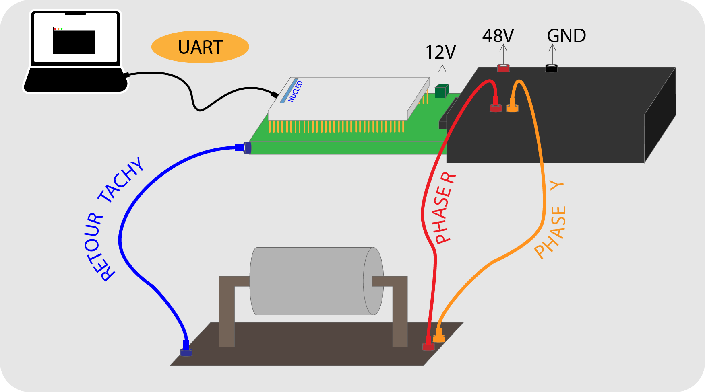
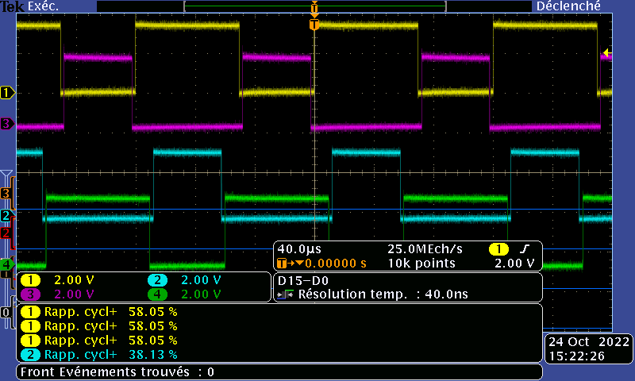
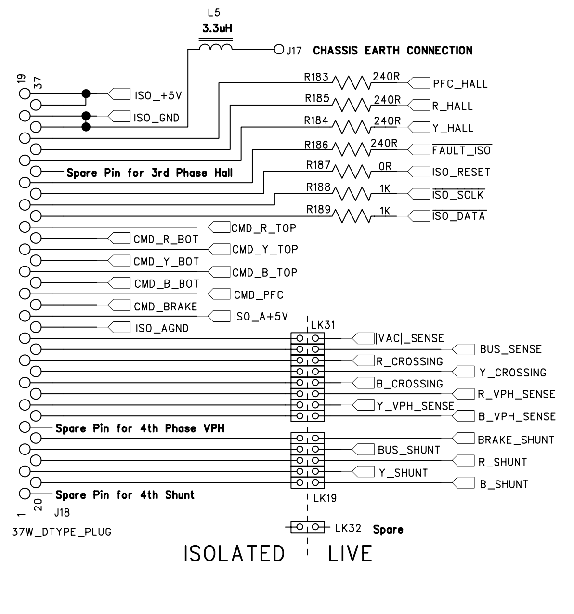

# 
Commande et Asservissement MCC

## Objectifs

Le but de ce TP est de commander puis d'asservir une MCC grâce à une STM32 et une interface de contrôle

**Materiel utlisé :**

* Nucleo-STM32G474RE
* Carte Electronique De transition (STM32 vers Hacheur)
* Un Hacheur dsPICDEMTM MC1L 3-PHASE
* STM32CubeIDE
* Une MCC avec sa géneratrice Tachymétrique

**On réalise un Schémas du montage :**

## Commande MCC basique 

L'objectif de cette partie est de :

* Générer 4 PWM en complémentaire décalée pour contrôler en boucle ouverte le moteur en respectant le cahier des charges,
* Inclure le temps mort.
* Vérifier les signaux de commande à l'oscilloscope.
* Prendre en main le hacheur.
* Câbler correctement la STM32 au hacheur.
* Générer le signal de commande "start" en fonction de la datasheet.
* Faire un premier essai de commande moteur.

### Géneration de 4 PWM

Nous souhaitons les caractéristiques suivantes :

* Fréquence de la PWM : **16kHz**
* Temps mort minimum : **2us**
* Résolution minimum : **10bits**
* PWM en commande complémentaire décalée

**Calcul de la fréquence :**

On configure donc le TIM1 pour génerer des PWM sur les channels 1 et 2 ainsi que leurs complémentaires respectivent. 

On veut une résolution de 10bits on doit donc avoir 2^10-1 = 1024-1 tics de timer. On a donc `ARR = 1024 -1`

On veut de plus une fréquence de travail de 16kHz. Notre fréquence d'horloge est de 170MHz on a donc `f_timer = f_horloge / (ARR + 1)(PSC + 1 )`

On a donc `PSC = 10 - 1` pour obtenir une fréquence de `f_timer = 16,6kHz`. Soit 3,75% d'erreur ce qui est satisfaisant.

On décide de choisir un rapport cyclique `a=0,6` et `a'=1-0,6` pour les tests.

On doit aussi génerer des commandes complémentaires décalée donc on met l'option `Counter Mode: Center Align Mode 1`

#### Calcul du temps mort

Le tick du temps mort est syncronisé sur la SysTick, qui est 170 MHz sur notre projet

On configure `dead time = 210 ticks` ce qui nous donne un ` temps mort = 12us > 2us` .

Nous pouvons voir sur l'oscilloscope les PWM et le dead time:

#### Prise en main du hacheur et cablâge

Le module est en fait un hacheur 4 quadrants permettant de délivrer la puissance aux différentes phases de notre moteur.
Nous le commandons grâce aux PWM générées. Les deads times permettent d'éviter des cours circuits car le temps de commutations des transistors est non nul.

Nous travaillons sur deux phases du module (bleu et jaune), Le PinOut STM32 -> Module est le suivant:

|STM32 | Broche|
|---------|--------|
| GND|36 |
| PWN 1|11 |
| PWN 1N| 29|
| PWM 2| 12|
| PWM 2N| 30|
| Iso reset|15 |

Où les broches du connecteur du modules sont documenté ci dessous:

#### Commande start

Le hacheur a besoin d'une séquence d'amorçage pour démarer.
En regardant dans la datasheet, on lit que le hacheur a besoin d’avoir une impulsion
d’au moins 2ms sur la pin Iso_reset (broche 33) pour pouvoir démarrer.

On utilise donc un simple `GPIO_Out` pour démarer le module.
On décide aussi d'utiliser le `User_Button` pour déclencher la séquence d'amorcage en le configurant sur `GPIO_EXTI`.

> ⚠️  Il faut bien penser à mettre la priorité de l'interruption plus petite que la priorité du SysTick si on utilise un HAL_Delay()

#### Premiers tests

On fait un premier test avec un rapport cyclique de 60% qui est concluant.

## Interface de contrôle

Dans cette partie nous réalisons un shell pour avoir une interface de contrôlle.

Il nous permettra de :

* Démarer le moteur
* Arrêter le moteur
* Impleter les futurs fonctions de commande

Ce shell est en fait une liaison série UART entre notre ordinateur et la STM32.

Nous une utilisons l'UART en interruption pour la reception, car nous ne pouvons pas nous permettre de mobiliser 100% du CPU en attendant les caractères envoyés par l'utilisateur.

On utilise la fonction de callback `HAL_UART_RxCpltCallback` pour traiter la logique.

Lors de la reception d'une chaine de caractère envoyé depuis notre ordinateur la STM32 va effectuer des fonctions que l'on a codé et nous renvoyer une chaine de caractère confirmant la commande.

On implémente la fonction `start` qui doit nous renvoyer `powerOn` et qui démare le moteur.

Ainsi que la fonction `stop` qui désactive simplement les PWM. 

## Commande et Asservissement

### Commande Vitesse

Pour controler la vitesse du moteur, nous allons envoyer une séquence via la liaison UART () de la forme :

**speed=XX** où XX est le rapport cyclique de la PWM1

Lors de la reception d'une valeur on change alors le registre CCR, pour modifier le rapport cyclique et ainsi la vitesse.

On remarque que lorsque la valeur de rapport cyclique est trop éloigné de la valeur actuelle, le système déclenche une sécurité car cela provoque un grand pic de courant

Pour palier à ce problème nous incrémentons pas à pas le CCR

<a>"https://github.com/Artpel1805/ActionneurESE/blob/5bacd98ae387ad19551c07d27ae12c279950304c/ActionneurESE_IDE/Core/Src/asservissement.c#L50-L53"</a>

### Asservissement Vitesse
Notre module comportes 3 signaux en sortie  : 2 signaux en quadrature de phase qui nous permettent de savoir le sens de rotation et un signal qui nous determine la fin d'un tour complet .
En utilisant l'INC 

### Asservissement Courant 

Le hâcheur permet grâce à des capteurs Hall de mesurer le courant traversant chaque phase.
Le signal renvoyé par le hâcheur est un signal analogique on doit donc utiliser l'ADC de notre STM32 pour pouvoir convertir en `int`

On décide d'utiliser l'ADC avec le DMA pour de meilleures performances.

On trigger l'ADC sur les Ticks du TIM1.

Il faut donc activer le `Trigger Event` sur TIM1.
Pour pouvoir aussi effectuer plusieurs mesures on configure bien le DMA en `Circular`.

On récupère une valeure de tension de l'ADC mais il faut la convertir en A. On a une équation du type : 
* A = aV +b

Cependant notre récupération du courant n'a pas fonctionné: 

On récupère bien une valeure de courant cohérente la première fois et l'on rentre à chaque Tick de TIM1 dans la callBack de l'ADC mais il semblerait que le DMA ne stocke qu'une valeure dans notre Buffer.

